## Part 1. Инструмент ipcalc
#### 1.1. Сети и маски
##### ОпределиТь и записать в отчёт:
##### 1) Адрес сети 192.167.38.54/13
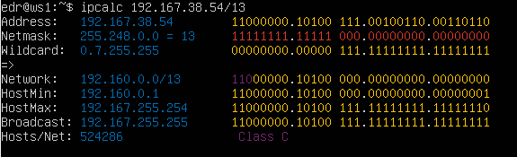
##### 2) Перевод маски 255.255.255.0 в префиксную и двоичную запись, /15 в обычную и двоичную, 11111111.11111111.11111111.11110000 в обычную и префиксную
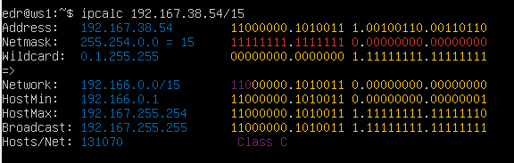
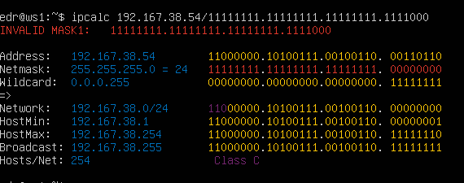
##### 3) Минимальный и максимальный хост в сети 12.167.38.4 при масках: /8, 11111111.11111111.00000000.00000000, 255.255.254.0 и /4
MIN host: 12.0.0.1 MAX host: 12.255.255.254
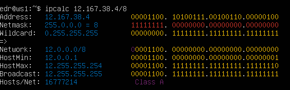
MIN host: 12.167.38.1 MAX host: 12.167.38.254
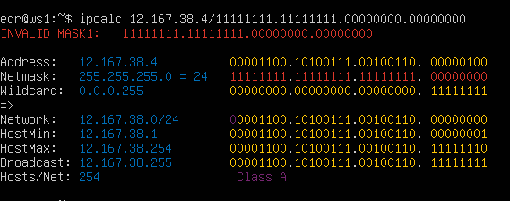
MIN host: 12.167.38.1 MAX host: 12.167.39.254
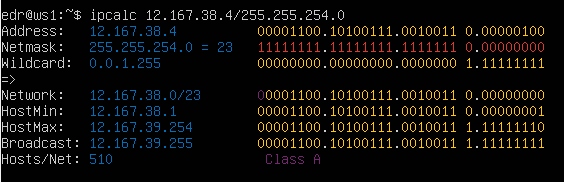
MIN host: 0.0.0.1 MAX host: 15.255.255.254
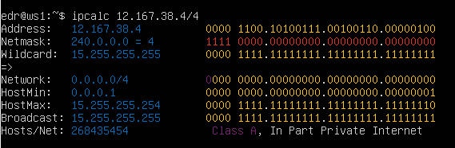
#### 1.2. localhost
##### Определить и запиши в отчёт, можно ли обратиться к приложению, работающему на localhost, со следующими IP: 194.34.23.100, 127.0.0.2, 127.1.0.1, 128.0.0.1
- IP 194.34.23.100 не подходит:

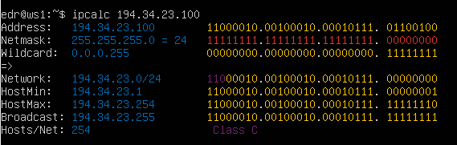
- IP 127.0.0.2 подходит:

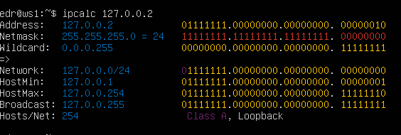
- IP  127.1.0.1 подходит:

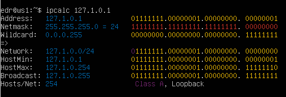
- IP 128.0.0.1 подходит:

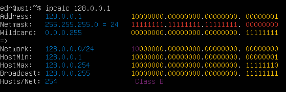
#### 1.3. Диапазоны и сегменты сетей
##### Определить и записать в отчёт:
##### 1) Какие из перечисленных IP можно использовать в качестве публичного, а какие только в качестве частных: 10.0.0.45, 134.43.0.2, 192.168.4.2, 172.20.250.4, 172.0.2.1, 192.172.0.1, 172.68.0.2, 172.16.255.255, 10.10.10.10, 192.169.168.1
- Частные: 10.0.0.45, 192.168.4.2, 172.20.250.4, 172.16.255.255, 10.10.10.10:
  
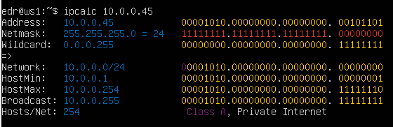
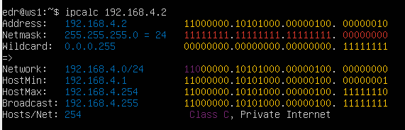
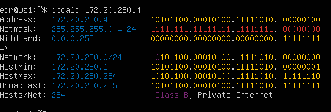
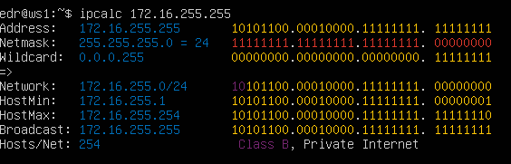
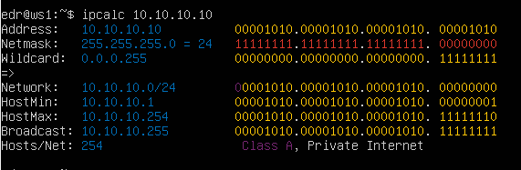
- Публичные: 134.43.0.2, 172.0.2.1, 192.172.0.1, 172.68.0.2, 192.169.168.1

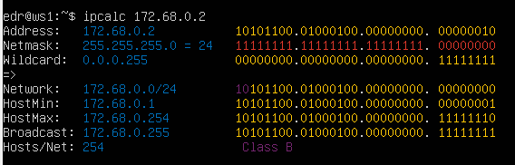
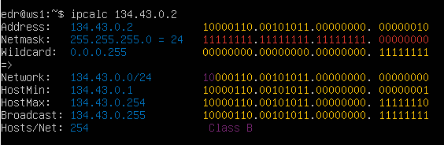
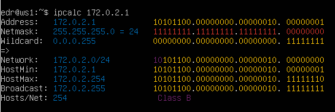
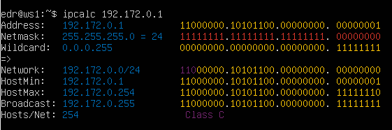
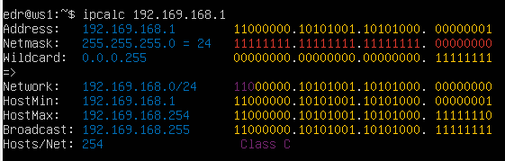

##### 2) Какие из перечисленных IP адресов шлюза возможны у сети 10.10.0.0/18: 10.0.0.1, 10.10.0.2, 10.10.10.10, 10.10.100.1, 10.10.1.255
- Возможные адреса: 10.0.0.1, 10.10.0.2, 10.10.10.10, 10.10.1.255

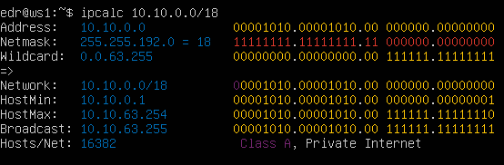
## Part 2. Статическая маршрутизация между двумя машинами
##### Поднять две виртуальные машины (далее -- ws1 и ws2)
##### С помощью команды ip a посмотреть существующие сетевые интерфейсы
- ws1

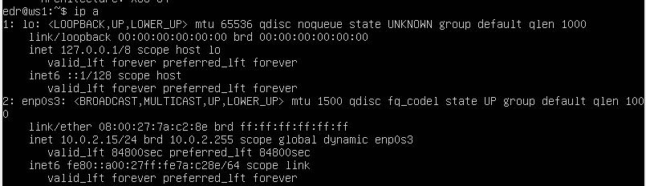
- ws2
  
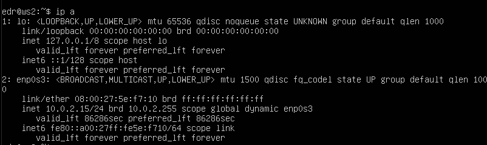
##### На обеих машинах и задать следующие адреса и маски: ws1 - 192.168.100.10, маска /16, ws2 - 172.24.116.8, маска /12.
- ws1
  
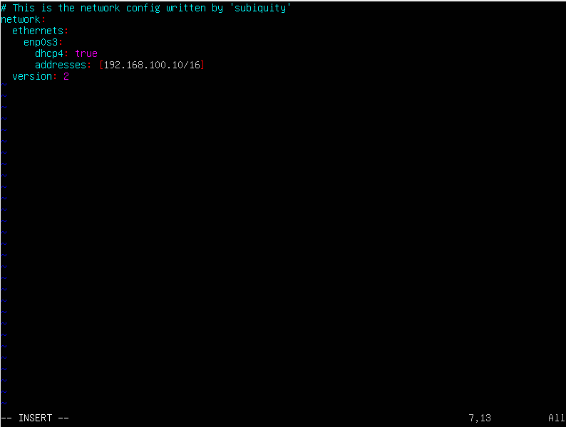

- ws2
  
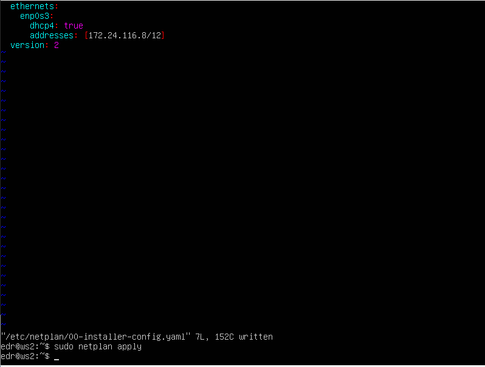
#### 2.1. Добавление статического маршрута вручную
##### Добавить статический маршрут от одной машины до другой и обратно при помощи команды вида `ip r add`.
##### Пропинговать соединение между машинами.
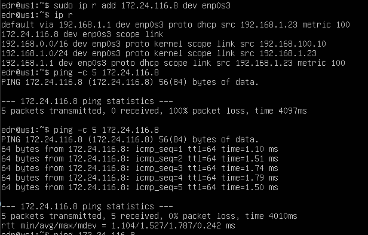
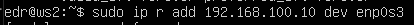
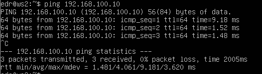
#### 2.2. Добавление статического маршрута с сохранением
##### Перезапустить машины.
##### Добавить статический маршрут от одной машины до другой с помощью файла *etc/netplan/00-installer-config.yaml*.
- ws1

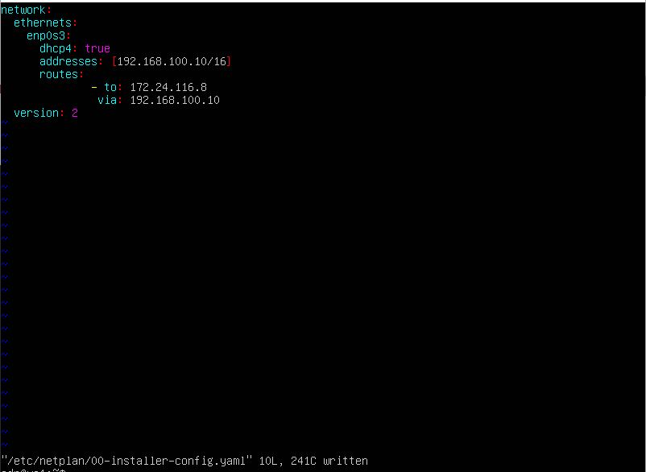
- ws2
  
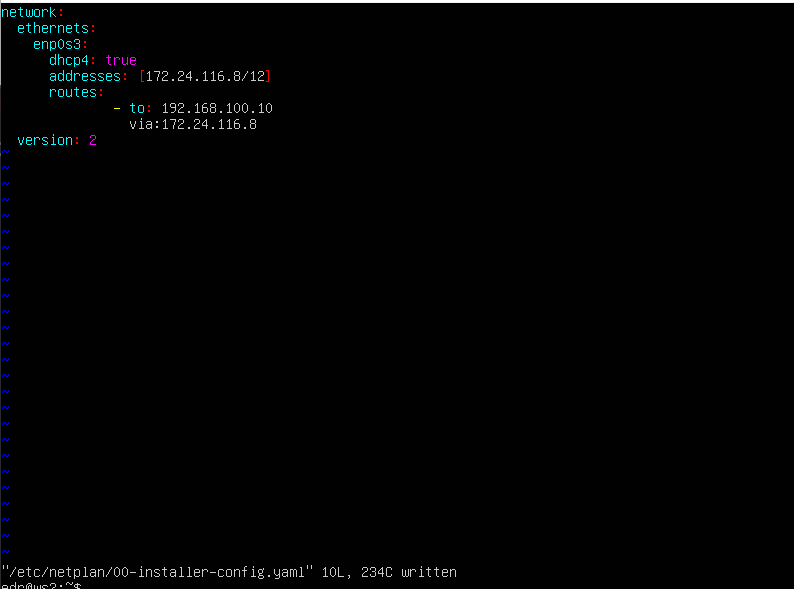
dhcp4 - включает или отключает автоматическое получение IP-адреса.
##### Пропинговать соединение между машинами.
- ws1

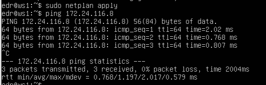
- ws2

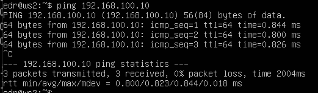
## Part 3. Утилита **iperf3**
#### 3.1. Скорость соединения
##### Перевести и записать в отчёт: 8 Mbps в MB/s, 100 MB/s в Kbps, 1 Gbps в Mbps
8 Mbps = 1 MB/s
100 MB/s = 819200 Kbps
1 Gbps = 1024 Mbps
#### 3.2. Утилита **iperf3**
##### Измерить скорость соединения между ws1 и ws2.
 iperf - это генератор сетевого трафика, предназначенный для проверки скорости и пропускной способности сети. -s - в режиме сервера.
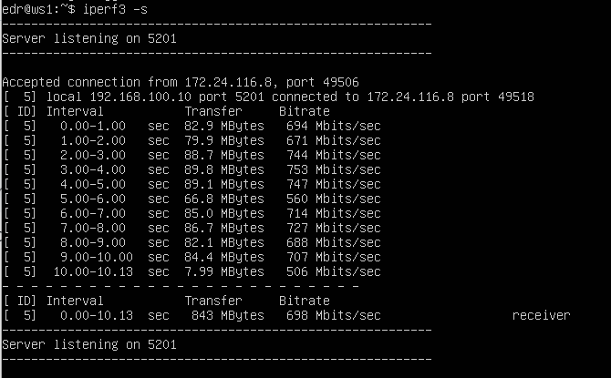
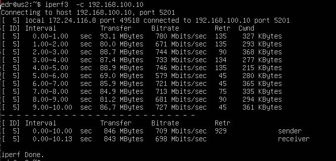
## Part 4. Сетевой экран
#### 4.1. Утилита **iptables**
##### Создать файл */etc/firewall.sh*, имитирующий фаерволл, на ws1 и ws2.
##### Нужно добавить в файл подряд следующие правила:
##### 1) На ws1 примени стратегию, когда в начале пишется запрещающее правило, а в конце пишется разрешающее правило (это касается пунктов 4 и 5).
##### 2) На ws2 примени стратегию, когда в начале пишется разрешающее правило, а в конце пишется запрещающее правило (это касается пунктов 4 и 5).
##### 3) Открой на машинах доступ для порта 22 (ssh) и порта 80 (http).
##### 4) Запрети *echo reply* (машина не должна «пинговаться», т.е. должна быть блокировка на OUTPUT).
##### 5) Разреши *echo reply* (машина должна «пинговаться»).

 С помощью iptables администраторы создают и изменяют правила, управляющие фильтрацией и перенаправлением пакетов. 
- ws1
  
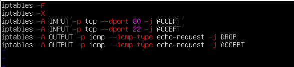
- ws2
  
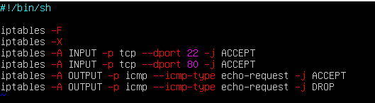
##### Запустить файлы на обеих машинах командами `chmod +x /etc/firewall.sh` и `/etc/firewall.sh`.
- ws1
  
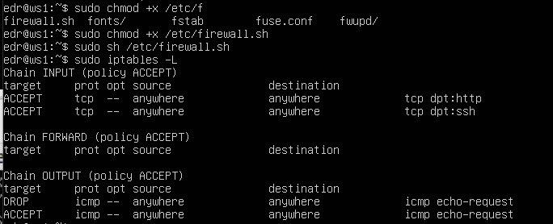
- ws2
  
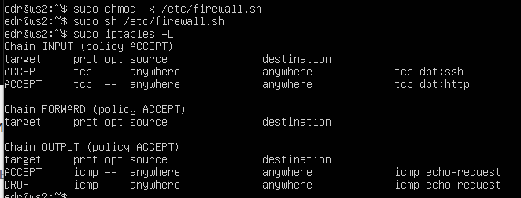

#### 4.2. Утилита **nmap**
##### Командой **ping** найти машину, которая не «пингуется», после чего утилитой **nmap** показать, что хост машины запущен.
- ws1
  
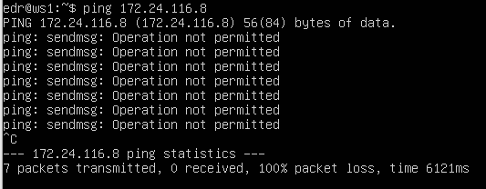
- ws2
  
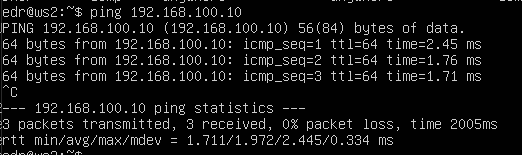
nmap - это сканер сети.
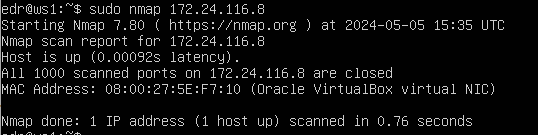

## Part 5. Статическая маршрутизация сети
#### 5.1. Настройка адресов машин
##### Настроить конфигурации машин в *etc/netplan/00-installer-config.yaml* согласно сети на рисунке.
- ws11 

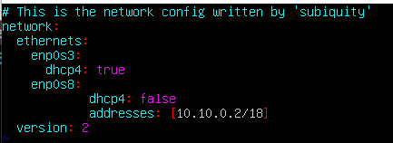
- ws21

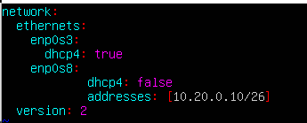
- ws22 
  
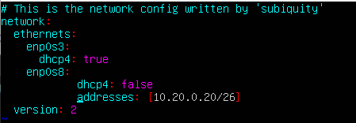
- r1

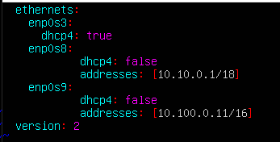
- r2

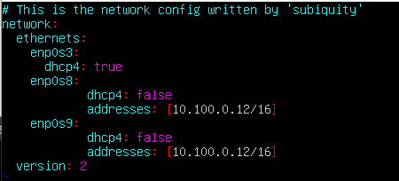
##### Перезапустить сервис сети. Если ошибок нет, то командой `ip -4 a` проверить, что адрес машины задан верно. Пропинговать ws22 с ws21, r1 с ws11.
- ws11

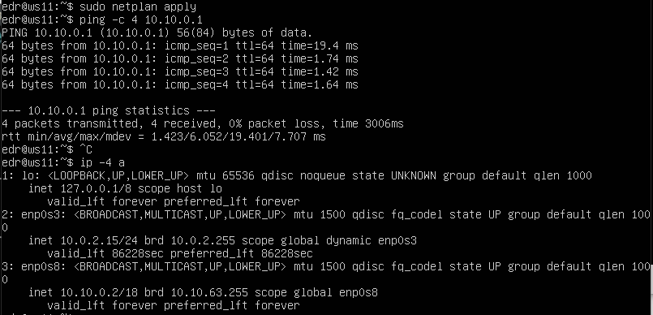
- ws21

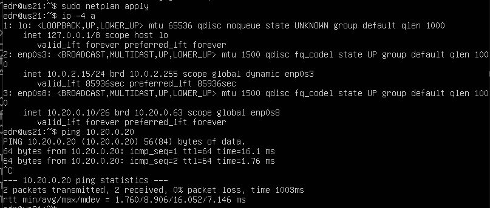
- ws22

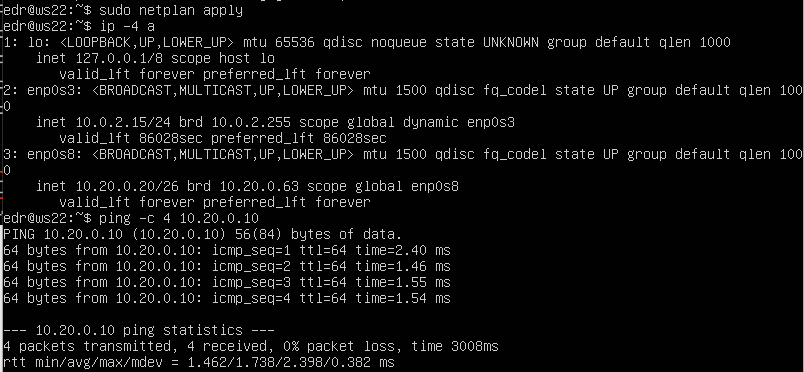
- r1

- r2
  

#### 5.2. Включение переадресации IP-адресов
##### Для включения переадресации IP, выполнить команду на роутерах:
`sysctl -w net.ipv4.ip_forward=1`
- r1
  

- r2
  

#### 5.3. Установка маршрута по-умолчанию
##### Настроить маршрут по-умолчанию (шлюз) для рабочих станций.
- ws11

- ws21

- ws22

##### Вызвать `ip r` и показать, что добавился маршрут в таблицу маршрутизации.
- ws11

- ws21

- ws22

##### Пропинговать с ws11 роутер r2 и показать на r2, что пинг доходит. Использовать `tcpdump -tn -i eth0`
Сначала запустить на r2 утилиту tcpdump, она позволяет прослушать порты и вывести на экран информацию с каких IP адресов приходят пакеты. В данном случае слушаем интерфейс enp0s8. Для захвата пакетов, проходящих через определенный интерфейс, используйте -i с именем интерфейса.

Затем пропинговать с ws11 роутер r2.

#### 5.4. Добавление статических маршрутов
##### Добавить в роутеры r1 и r2 статические маршруты в файле конфигураций.
- r1

- r2

##### Вызвать `ip r` и покзать таблицы с маршрутами на обоих роутерах.
- r1

- r2

##### Запустить команды на ws11: `ip r list 10.10.0.0/[маска сети] `и `ip r list 0.0.0.0/0`

#### 5.5. Построение списка маршрутизаторов
##### Запустить на r1 команду дампа:
`tcpdump -tnv -i enp0s8`

##### При помощи утилиты **traceroute** построить список маршрутизаторов на пути от ws11 до ws21.

#### 5.6. Использование протокола **ICMP** при маршрутизации
##### Запустить на r1 перехват сетевого трафика, проходящего через eth0 с помощью команды:
`tcpdump -n -i eth0 icmp`

##### Пропинговать с ws11 несуществующий IP (например, *10.30.0.111*).

## Part 6. Динамическая настройка IP с помощью **DHCP**
##### Для r2 настроить в файле */etc/dhcp/dhcpd.conf* конфигурацию службы **DHCP**:
##### 1) Указать адрес маршрутизатора по-умолчанию, DNS-сервер и адрес внутренней сети. 

##### 2) В файле *resolv.conf* прописать `nameserver 8.8.8.8`.

##### Перезагрузить службу **DHCP** командой `systemctl restart isc-dhcp-server`.

##### Машину ws21 перезагрузить при помощи `reboot` и через `ip a` показать, что она получила адрес. 

##### Пропинговать ws22 с ws21.

##### Указать MAC адрес у ws11, для этого в *etc/netplan/00-installer-config.yaml* надо добавить строки: `macaddress: 10:10:10:10:10:BA`, `dhcp4: true`.

##### Для r1 настроить аналогично r2, но сделать выдачу адресов с жесткой привязкой к MAC-адресу (ws11).

##### В файле *resolv.conf* прописать `nameserver 8.8.8.8`.

##### Перезагрузить службу **DHCP** командой `systemctl restart isc-dhcp-server`. 

##### Машину ws21 перезагрузить при помощи `reboot` и через `ip a` показать, что она получила адрес.

- Пинг ws22 с ws11

IP  до обновления:

Запросим с ws21 обновление ip адреса с помощью команды sudo dhclient -v

IP  после обновления:

sudo dhclient задает новый адрес указанному интерфейсу.
sudo dhclient -v выводит полную информацию.
## Part 7. **NAT**
##### В файле */etc/apache2/ports.conf* на ws22 и r1 изменить строку `Listen 80` на `Listen 0.0.0.0:80`, то есть сделать сервер Apache2 общедоступным.
- ws22

- r1

##### Запустить веб-сервер Apache командой `service apache2 start` на ws22 и r1.
- r1

- ws22

Проверить соединение между ws22 и r1 командой ping
При запуске файла с этими правилами, ws22 не должна "пинговаться" с r1

##### Добавить в фаервол, созданный по аналогии с фаерволом из Части 4, на r2 следующие правила:
##### 1) Удаление правил в таблице filter - `iptables -F`;
##### 2) Удаление правил в таблице "NAT" - `iptables -F -t nat`;
##### 3) Отбрасывать все маршрутизируемые пакеты - `iptables --policy FORWARD DROP`.

ICMP (Internet Control Message Protocol) - это протокол третьего уровня модели OSI, который используется для диагностики проблем со связностью в сети.
##### Проверь соединение между ws22 и r1 командой `ping`.

##### Добавить в файл ещё два правила:
##### 5) Включить **SNAT**, а именно маскирование всех локальных ip из локальной сети, находящейся за r2 (по обозначениям из Части 5 - сеть 10.20.0.0).
##### 6) Включить **DNAT** на 8080 порт машины r2 и добавить к веб-серверу Apache, запущенному на ws22, доступ извне сети.
SNAT (Source Network Address Translation) — механизм, суть которого состоит в замене адреса источника при пересылке пакета. DNAT — трансляция внешнего адреса во внутренний приватный адрес для доступа из интернета в сеть тенанта.

##### Проверить соединение по TCP для **SNAT**: для этого с ws22 подключиться к серверу Apache на r1 командой:
`telnet [адрес] [порт]`

##### Проверить соединение по TCP для **DNAT**: для этого с r1 подключиться к серверу Apache на ws22 командой `telnet` (обращаться по адресу r2 и порту 8080).

