## Part 1. Готовый докер
Docker — это платформа, которая предназначена для разработки, развёртывания и запуска приложений в контейнерах.
Докер-образ – «упаковка» для приложения и зависимостей (в том числе системных).
Контейнер – экземпляр образа, то есть «оживший» образ.
##### Возьмем официальный докер-образ с **nginx** и выкачаем его при помощи `docker pull`.

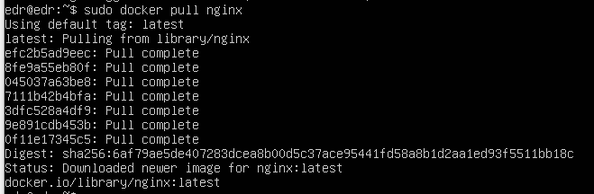

##### Проверяем наличие докер-образа через `docker images`.

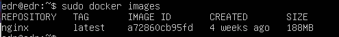

##### Запустим докер-образ через `docker run -d [image_id|repository]`.
##### Проверим, что образ запустился через `docker ps`.

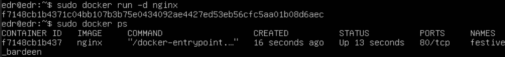

##### Посмотрим информацию о контейнере через `docker inspect [container_id|container_name]`.

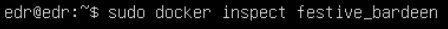

##### По выводу команды определим и поместим в отчёт размер контейнера, список замапленных портов и ip контейнера.
- Размер контейнера
  SizeRootFs общий размер всех файлов в контейнере в байтах. SizeRw это размер файлов, которые были изменены.

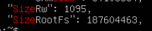

- Замапленный порт

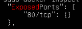

- IP-адрес контейнера: 172.17.0.2

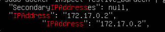

##### Остановим докер образ через `docker stop [container_id|container_name]` ,проверим, что образ остановился через `docker ps`.

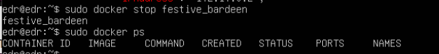

##### Запустим докер с портами 80 и 443 в контейнере, замапленными на такие же порты на локальной машине, через команду *run*.
nginx в конце означает запуск контейнера на основе образа nginx.
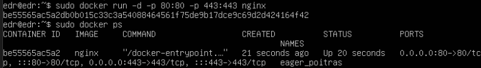

##### Проверим, что в браузере по адресу *localhost:80* доступна стартовая страница **nginx**.

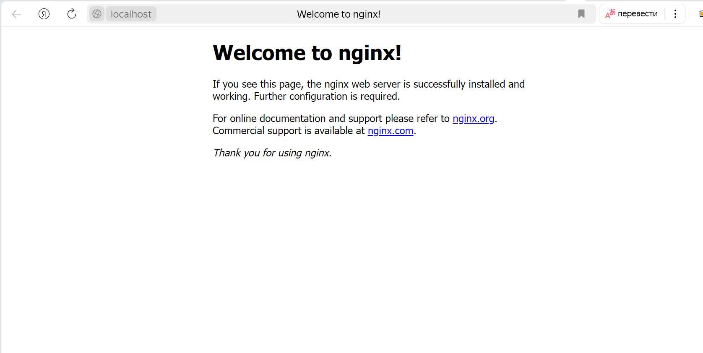

Проброс портов.

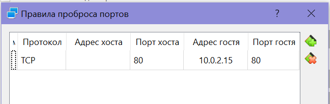

##### Перезапустим докер контейнер через `docker restart [container_id|container_name]`.

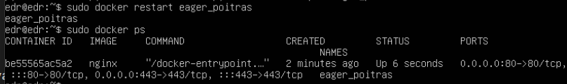

##### Проверим любым способом, что контейнер запустился.

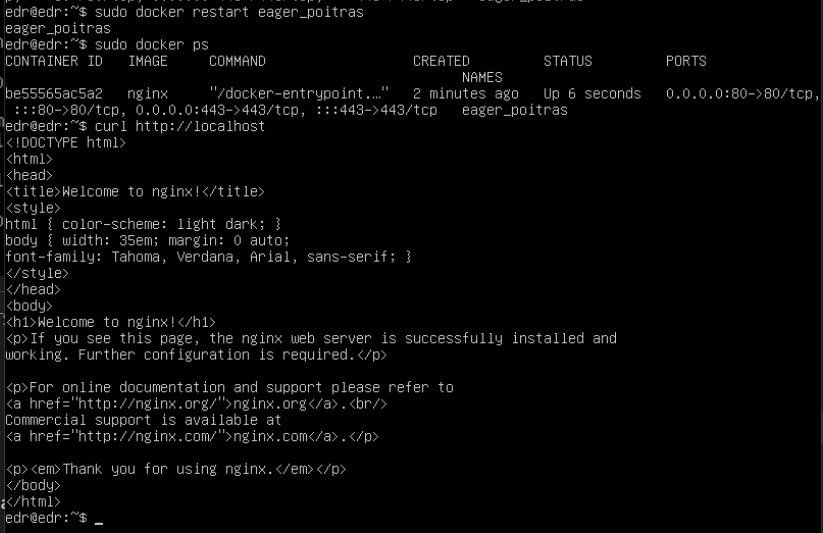

## Part 2. Операции с контейнером
##### Прочитаем конфигурационный файл *nginx.conf* внутри докер контейнера через команду *exec*.
`docker exec` — команда в Docker, которая позволяет выполнять команды внутри запущенного контейнера.
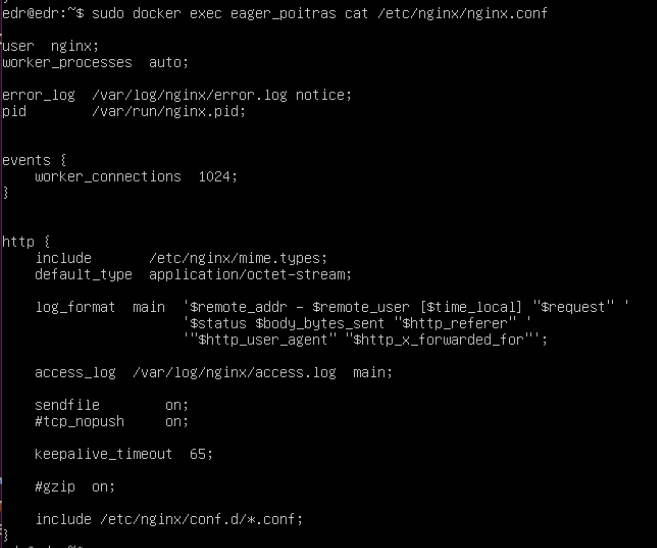

##### Создаем на локальной машине файл *nginx.conf*.

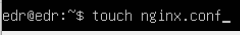

##### Настроим в нем по пути */status* отдачу страницы статуса сервера **nginx**.

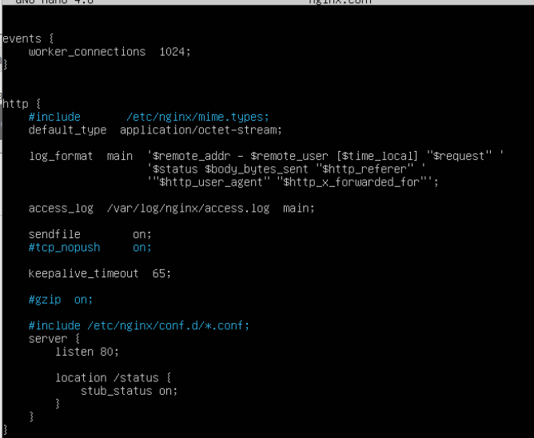

##### Скопируем созданный файл *nginx.conf* внутрь докер-образа через команду `docker cp`.

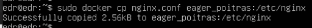

##### Перезапустим **nginx** внутри докер-образа через команду *exec*.

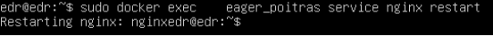

##### Проверим, что по адресу *localhost:80/status* отдается страничка со статусом сервера **nginx**.

##### Экспортируем контейнер в файл *container.tar* через команду *export*.

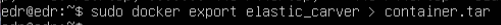

##### Остановим контейнер.

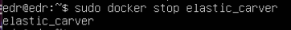

##### Удалим образ через `docker rmi [image_id|repository]`, не удаляя перед этим контейнеры.

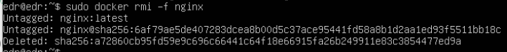

##### Удалим остановленный контейнер.

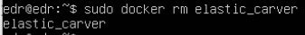

##### Импортируем контейнер обратно через команду *import*.

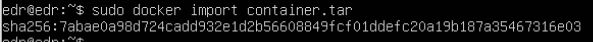

##### Запустим импортированный контейнер.

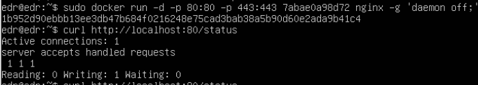

##### Проверим, что по адресу *localhost:80/status* отдается страничка со статусом сервера **nginx**.

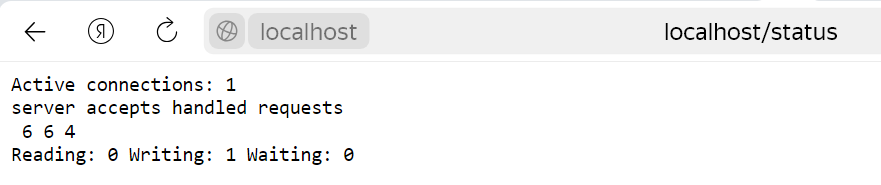

## Part 3. Мини веб-сервер
##### Напишем мини-сервер на **C** и **FastCgi**, который будет возвращать простейшую страничку с надписью `Hello World!`.

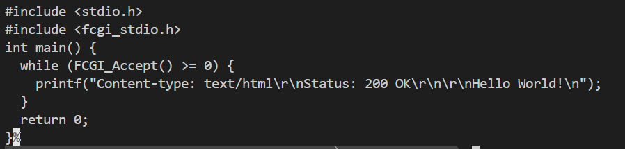

##### Напишем *nginx.conf*, который будет проксировать все запросы с 81 порта на *127.0.0.1:8080*.

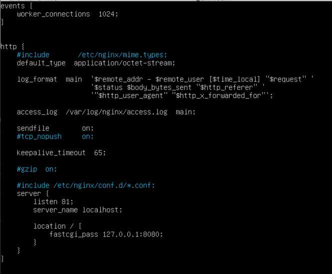

##### Запустим докер-образ с портом 81.

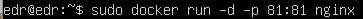

##### После перекинем nginx.conf и server.c в новый контейнер

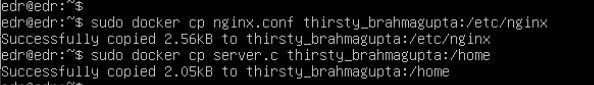

Установим необходимые пакеты: `apt-get update`, `apt-get install -y gcc spawn-fcgi libfcgi-dev`
##### Запустим мини-сервер через *spawn-fcgi* на порту 8080.

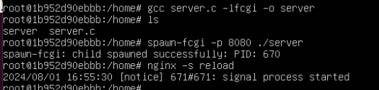

##### Проверь, что в браузере по *localhost:81* отдается написанная тобой страничка.

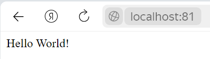

## Part 4. Свой докер
#### Напишем свой докер-образ, который:
1) собирает исходники мини сервера на FastCgi из части 3;
2) запускает его на 8080 порту;
3) копирует внутрь образа написанный *./nginx/nginx.conf*;
4) запускает nginx.
   
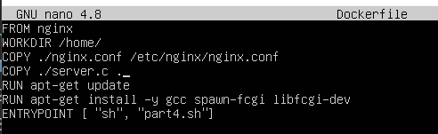
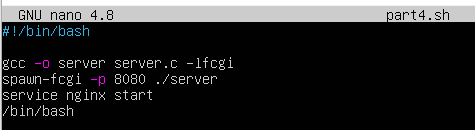

##### Соберем написанный докер-образ через `docker build` при этом указав имя и тег.
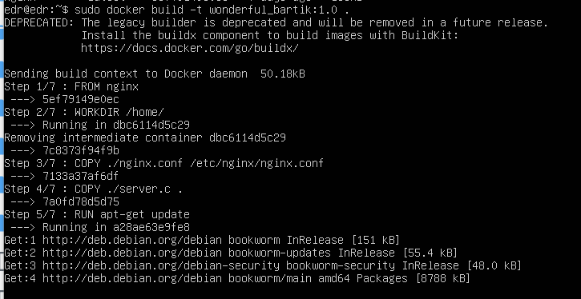
##### Проверим через `docker images`, что все собралось корректно.
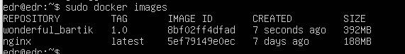
##### Запустим собранный докер-образ с маппингом 81 порта на 80 на локальной машине и маппингом папки *./nginx* внутрь контейнера по адресу, где лежат конфигурационные файлы **nginx**'а.
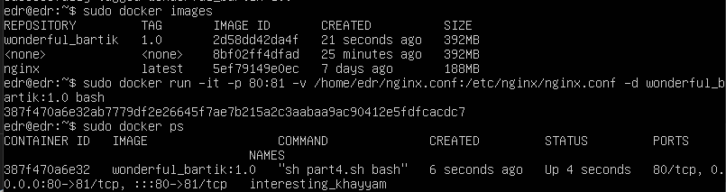
-d – запуск контейнера в фоновом режиме
-p – пробрасывание портов между хостом и контейнером
-v – примонтирование директории из хоста в контейнер

##### Проверим, что по localhost:80 доступна страничка написанного мини сервера.
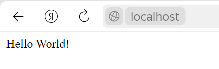

##### Допишем в *./nginx/nginx.conf* проксирование странички */status*, по которой надо отдавать статус сервера **nginx**.
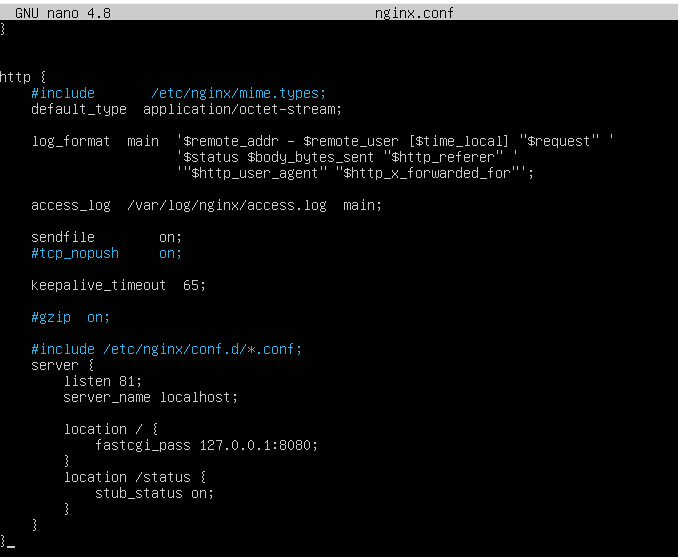

##### Перезапустим докер-образ.
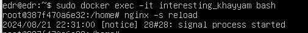

##### Проверим, что теперь по *localhost:80/status* отдается страничка со статусом **nginx**

## Part 5. **Dockle**
Dockle — это инструмент для проверки безопасности образов контейнеров, который можно использовать для поиска уязвимостей.
Установка dockle:
`VERSION=$(
 curl --silent "https://api.github.com/repos/goodwithtech/dockle/releases/latest" | \
 grep '"tag_name":' | \
 sed -E 's/.*"v([^"]+)".*/\1/' \
) && curl -L -o dockle.deb https://github.com/goodwithtech/dockle/releases/download/v${VERSION}/dockle_${VERSION}_Linux-64bit.deb`
`sudo dpkg -i dockle.deb && rm dockle.deb`

##### Просканируем образ из предыдущего задания через `dockle [image_id|repository]`.
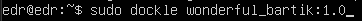
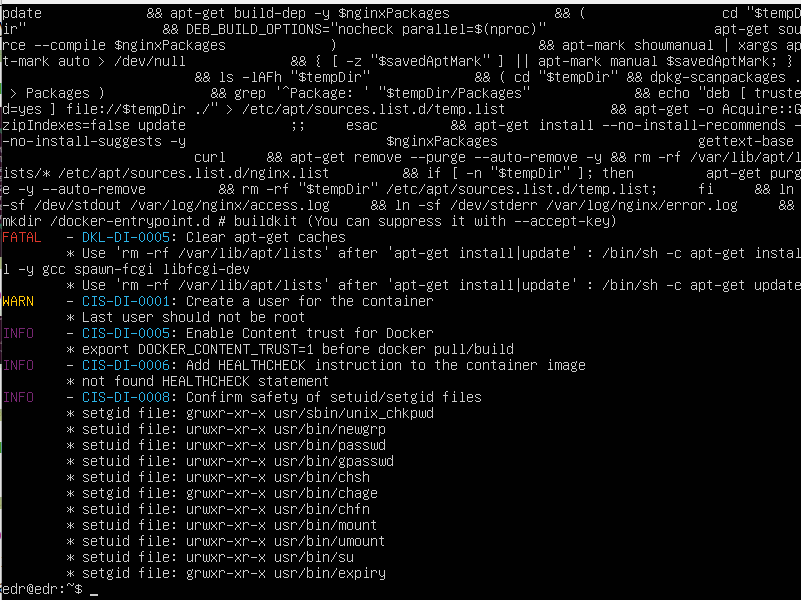

##### Исправим образ так, чтобы при проверке через **dockle** не было ошибок и предупреждений.
Исправленный Dockerfile:

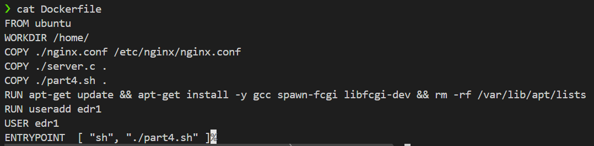

Создаем новый образ, чтобы проверить ошибки:

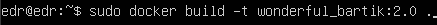

Создали образ wonderful_bartik с тегом 2.0:

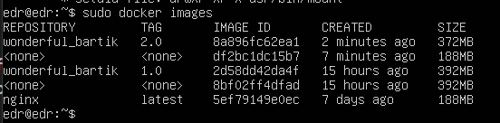

Проверка через `dockle`

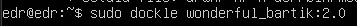

Результат:

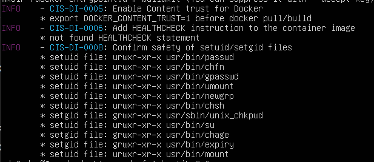
