## Part 1. Настройка **gitlab-runner**
##### Подними виртуальную машину *Ubuntu Server 22.04 LTS*.

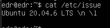

##### Скачать и установить на виртуальную машину **gitlab-runner**.

`curl -L "https://packages.gitlab.com/install/repositories/runner/gitlab-runner/script.deb.sh" | sudo bash`

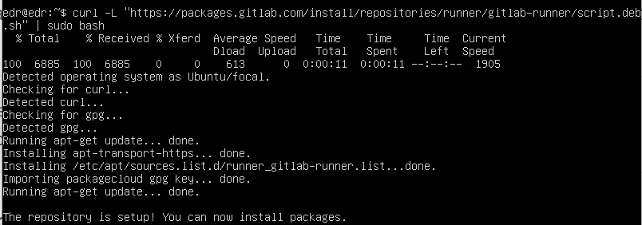

`sudo apt install gitlab-runner`

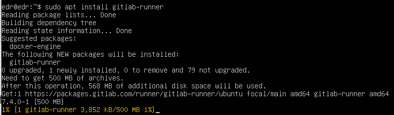

##### Запустить **gitlab-runner** и зарегистрируй его для использования в текущем проекте (*DO6_CICD*).

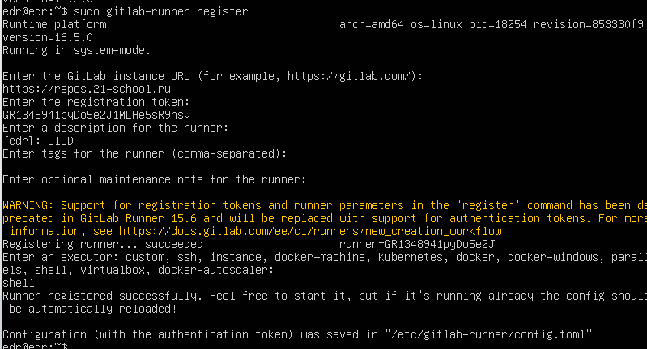

## Part 2. Сборка
Перенести cat и grep из проекта SimpleBashUtils в папку src.
##### Написать этап для **CI** по сборке приложений из проекта *C2_SimpleBashUtils*.

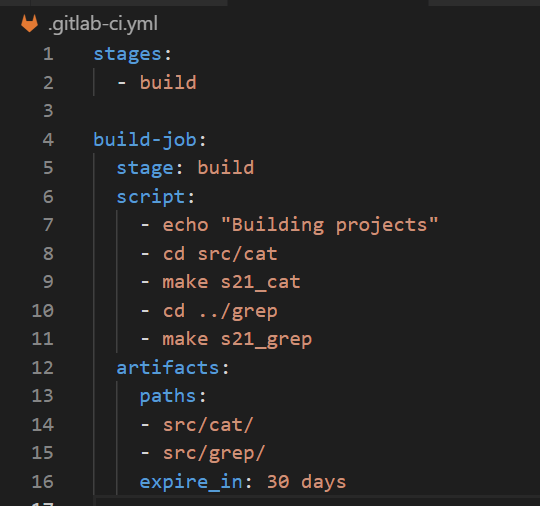
artifacts - промежуточные сборки или файлы. expire_in используется для указания срока хранения артефактов задания. paths указывает какие файлы сохранить в качестве артефактов

Проверим, что сборка прошла успешно на GitLab -> CI/CD

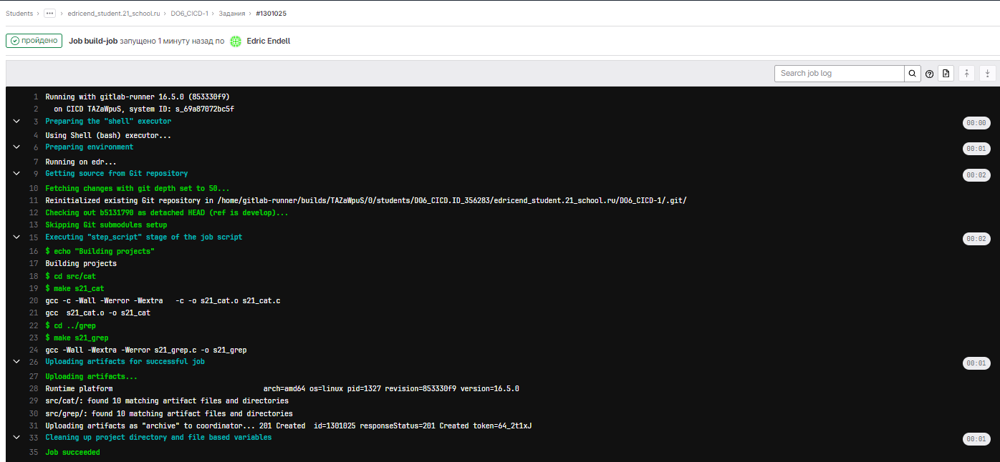

## Part 3. Тест кодстайла
##### Написать этап для **CI**, который запускает скрипт кодстайла (*clang-format*).
Необходимо установить clang-format:
`sudo apt install clang-format`

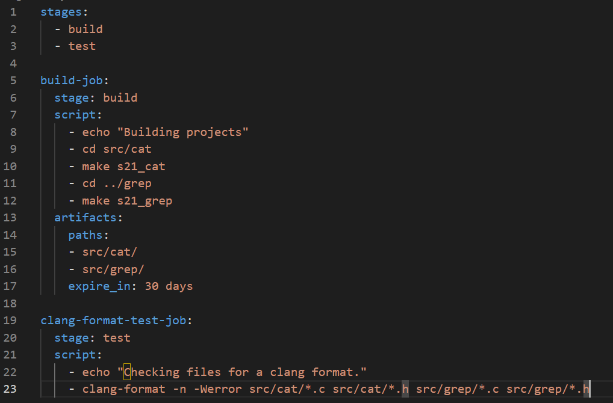

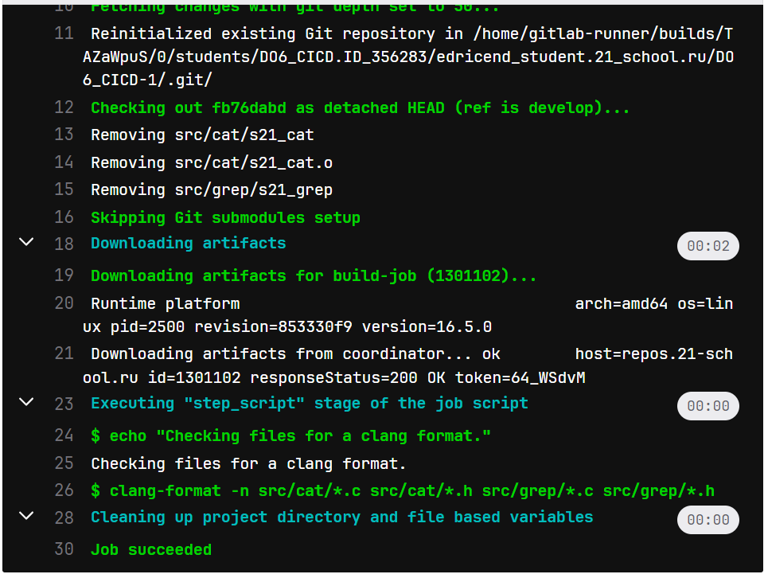

##### Если кодстайл не прошел, то «зафейлить» пайплайн.

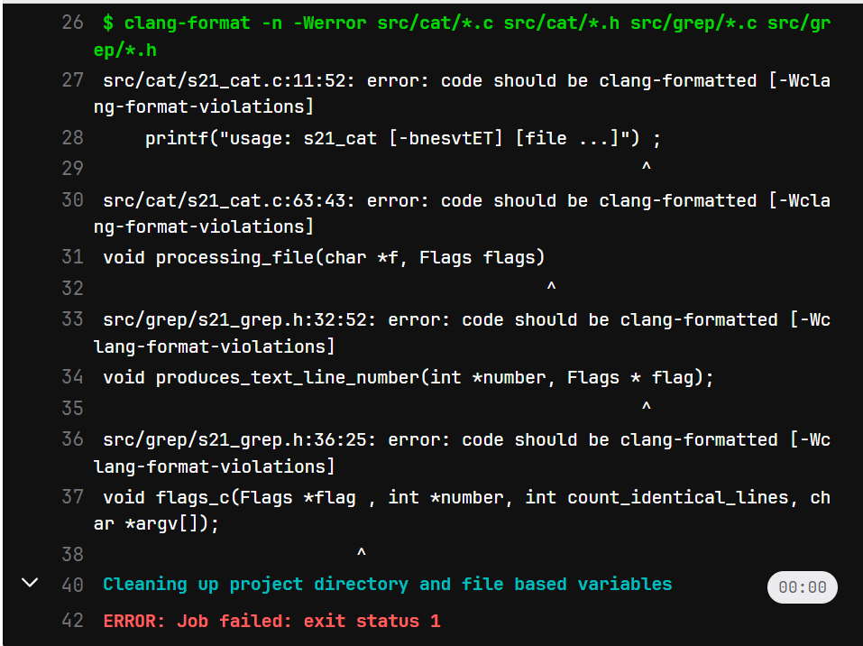

## Part 4. Интеграционные тесты
##### Написать этап для **CI**, который запускает твои интеграционные тесты из того же проекта.

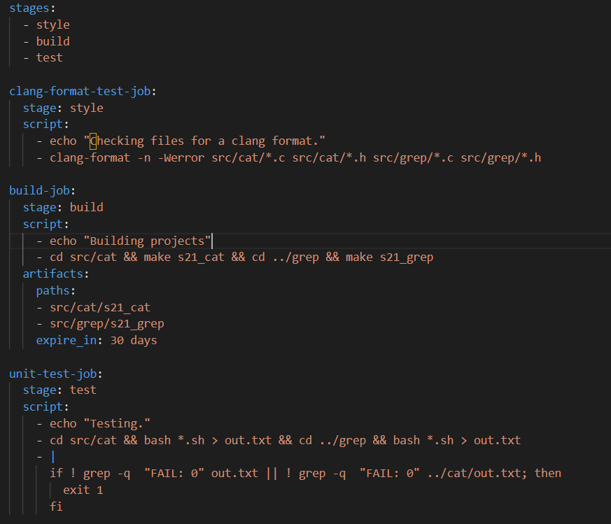

##### Запустить этот этап автоматически только при условии, если сборка и тест кодстайла прошли успешно.

Тесты прошли:

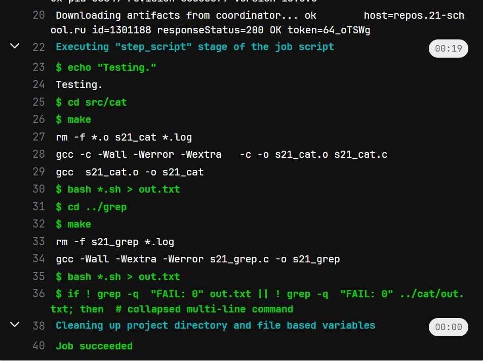

##### Если тесты не прошли, то «зафейлить» пайплайн.

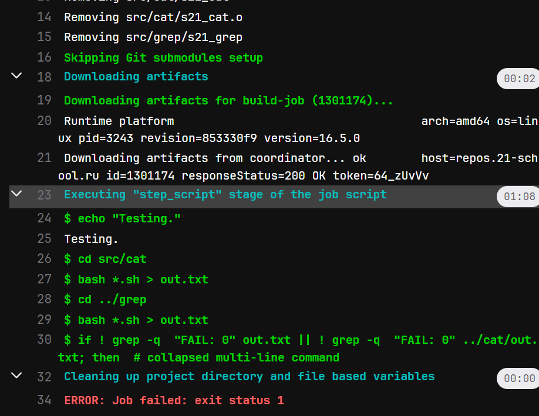

## Part 5. Этап деплоя
##### Поднять вторую виртуальную машину *Ubuntu Server 22.04 LTS*.
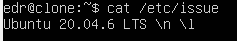

Перенастроим сетевые адаптеры:

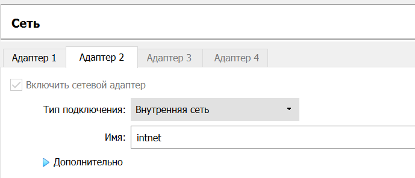

Проверим соединение между машинами:

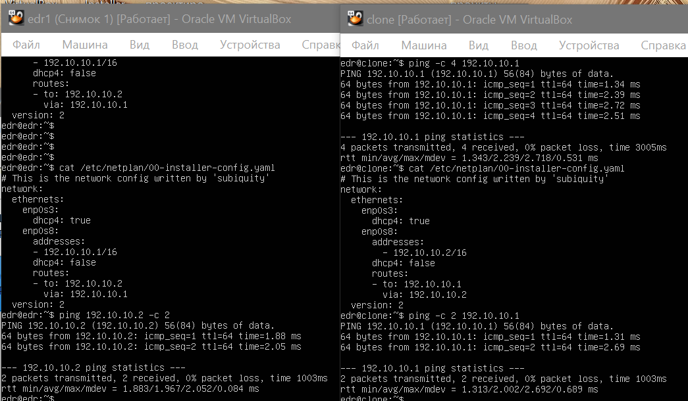

Заходим на первой машине под пользователя gitlab-runner `sudo su gitlab-runner`, создаём ключ `ssh-keygen`.

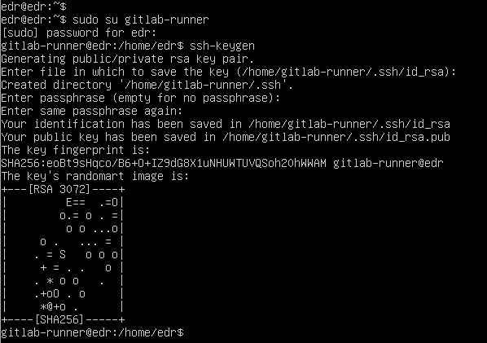

Копируем ключ на вторую машину:

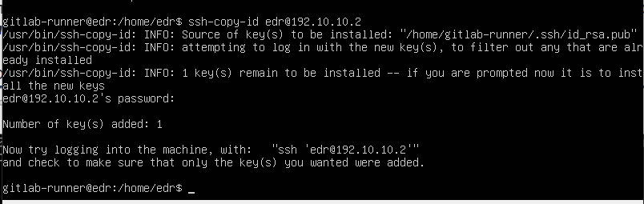

Проверяем, что ключ скопирован:

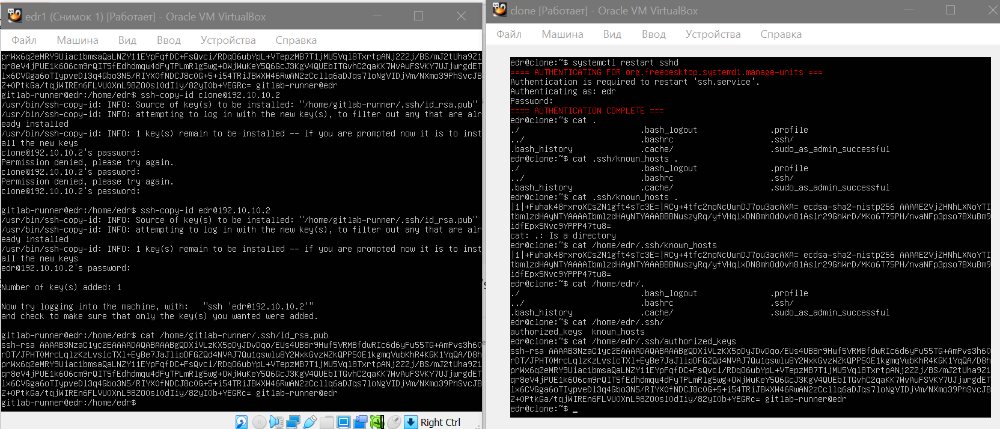
Даем необходимые права для пользователя gitlab-runner:
`sudo usermod -a -G sudo gitlab-runner`
`sudo usermod -a -G root gitlab-runner`

Снимем ограничение на использование пароля для sudo для пользователя gitlab-runner
`sudo visudo`
Добавим в файл 
`gitlab-runner ALL=(ALL) NOPASSWD: ALL`
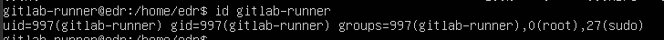
Добавим все права доступа для всех пользователей 
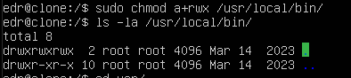
- r - права на чтение
w - права на запись
x - рава на выполнение

##### Написать bash-скрипт, который копирует файлы, полученные после сборки, в директорию */usr/local/bin* второй виртуальной машины.

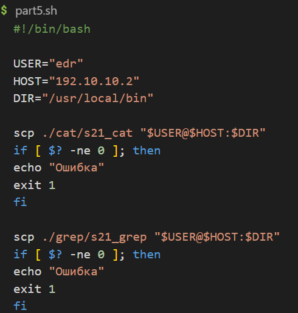
##### Написать этап для **CD**, который «разворачивает» проект на другой виртуальной машине. Запустить этот этап вручную при условии, что все предыдущие этапы прошли успешно.

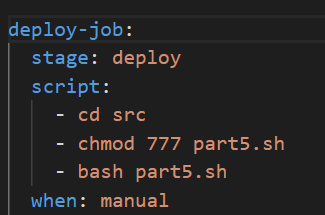
- `when: manual` - задание не начнет выполняться, пока мы не нажмем кнопку запуска.

Файлы скопированы:

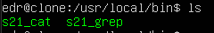

## Part 6. Дополнительно. Уведомления
##### Настроить уведомления об успешном/неуспешном выполнении пайплайна через бота с именем «edricend DO6 CI/CD» в *Telegram*.

Воспользуемся ботом BotFather. BotFather — это главный сервис в Телеграмме, через который происходит регистрация ботов.

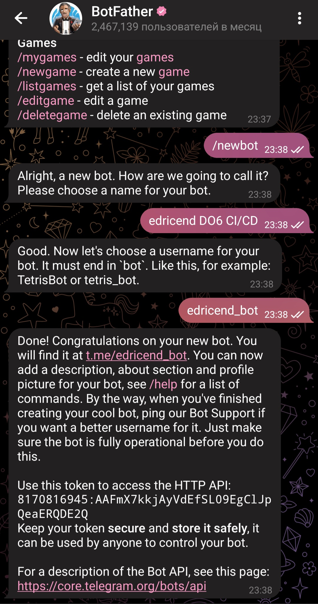

Узнаем ID с помощью getmyid_bot:

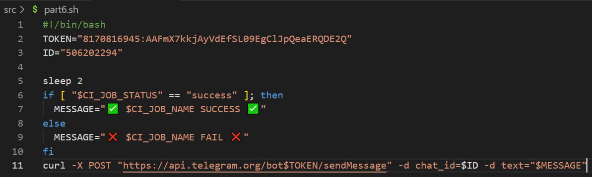

CI_JOB_NAME - Название этапа из .gitlab-ci.yml

Результат:

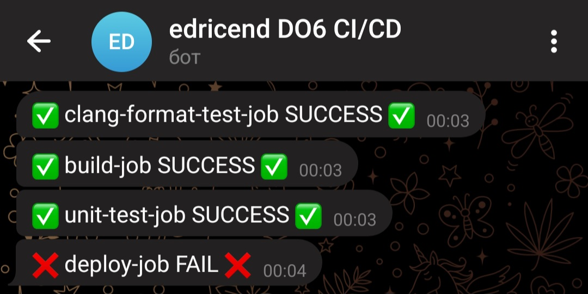

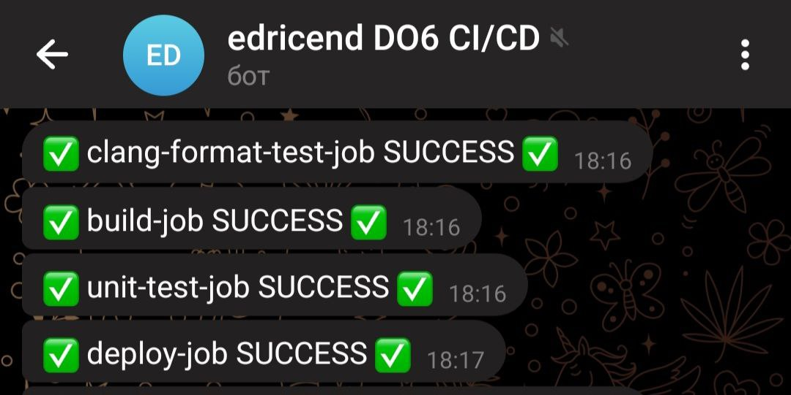