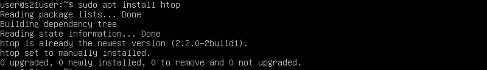
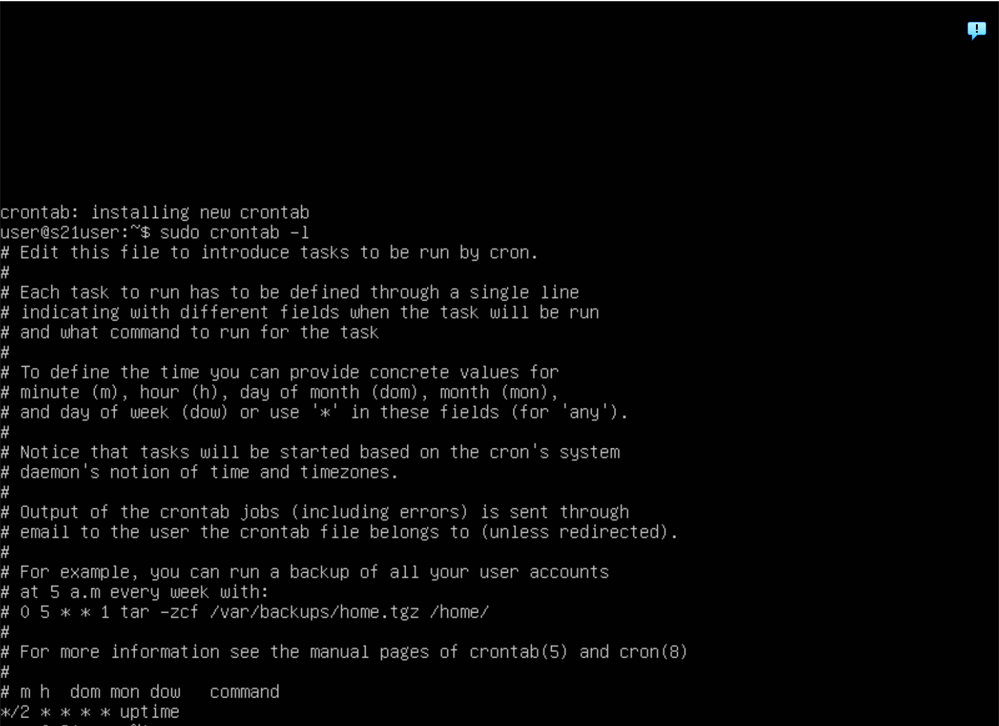

## Part 1. Установка ОС
- Установила Ubuntu 

## Part 2. Создание пользователя
- Создай пользователя, отличного от пользователя, который создавался при установке. Пользователь должен быть добавлен в группу adm.

! ! ! обрезать

## Part 3. Настройка сети ОС
- Задай название машины вида user-1

- Установи временную зону, соответствующую твоему текущему местоположению.

- Выведи названия сетевых интерфейсов с помощью консольной команды.

- Используя консольную команду получи ip адрес устройства, на котором ты работаешь, от DHCP сервера.

- Определи и выведи на экран внешний ip-адрес шлюза (ip) и внутренний IP-адрес шлюза, он же ip-адрес по умолчанию (gw).

- Задай статичные (заданные вручную, а не полученные от DHCP сервера) настройки ip, gw, dns (используй публичный DNS серверы, например 1.1.1.1 или 8.8.8.8).

- Перезагрузи виртуальную машину. Убедись, что статичные сетевые настройки (ip, gw, dns) соответствуют заданным в предыдущем пункте.

## Part 4. Обновление ОС
- Обнови системные пакеты до последней на момент выполнения задания версии.

## Part 5. Использование команды sudo
- Разреши пользователю, созданному в Part 2, выполнять команду sudo.

## Part 6. Установка и настройка службы времени
- Настрой службу автоматической синхронизации времени.

## Part 7. Установка и использование текстовых редакторов
- Установи текстовые редакторы VIM (+ любые два по желанию NANO, MCEDIT, JOE и т.д.)

- Используя каждый из трех выбранных редакторов, создай файл test_X.txt, где X -- название редактора, в котором создан файл. Напиши в нём свой никнейм, закрой файл с сохранением изменений.

- Используя каждый из трех выбранных редакторов, открой файл на редактирование, отредактируй файл, заменив никнейм на строку «21 School 21», закрой файл без сохранения изменений.

- Используя каждый из трех выбранных редакторов, отредактируй файл ещё раз (по аналогии с предыдущим пунктом), а затем освой функции поиска по содержимому файла (слово) и замены слова на любое другое.

@@

@@

## Part 8. Установка и базовая настройка сервиса SSHD
- станови службу SSHd.

- Добавь автостарт службы при загрузке системы.

- Перенастрой службу SSHd на порт 2022.

- Используя команду ps, покажи наличие процесса sshd. Для этого к команде нужно подобрать ключи.
- Перезагрузи систему

## Part 9. Установка и использование утилит top, htop

## Part 10. Использование утилиты fdisk

## Part 11. Использование утилиты df

## Part 12. Использование утилиты du

## Part 13. Установка и использование утилиты ncdu

## Part 14. Работа с системными журналами
Sun Apr 21 13:13 by LOGIN

## Part 15. Использование планировщика заданий CRON

uptime 22
