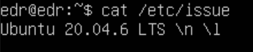
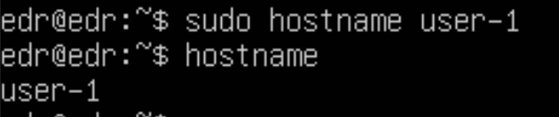
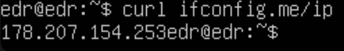
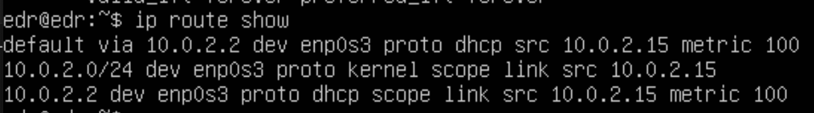
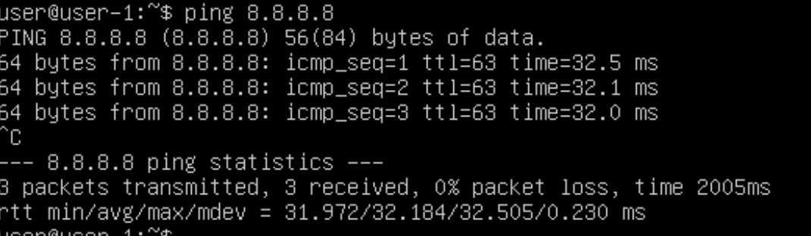

## Part 1. Установка ОС
- Установи Ubuntu 20.04 Server LTS без графического интерфейса.

## Part 2. Создание пользователя
- Создай пользователя, отличного от пользователя, который создавался при установке. Пользователь должен быть добавлен в группу adm.

! ! ! обрезать

## Part 3. Настройка сети ОС
- Задай название машины вида user-1

- Установи временную зону, соответствующую твоему текущему местоположению.

- Выведи названия сетевых интерфейсов с помощью консольной команды.

- Используя консольную команду получи ip адрес устройства, на котором ты работаешь, от DHCP сервера.

- Определи и выведи на экран внешний ip-адрес шлюза (ip) и внутренний IP-адрес шлюза, он же ip-адрес по умолчанию (gw).

- Задай статичные (заданные вручную, а не полученные от DHCP сервера) настройки ip, gw, dns (используй публичный DNS серверы, например 1.1.1.1 или 8.8.8.8).

- Перезагрузи виртуальную машину. Убедись, что статичные сетевые настройки (ip, gw, dns) соответствуют заданным в предыдущем пункте.

## Part 4. Обновление ОС
- Обнови системные пакеты до последней на момент выполнения задания версии.

uptime 22

14. Sun Apr 21 13:13 by LOGIN